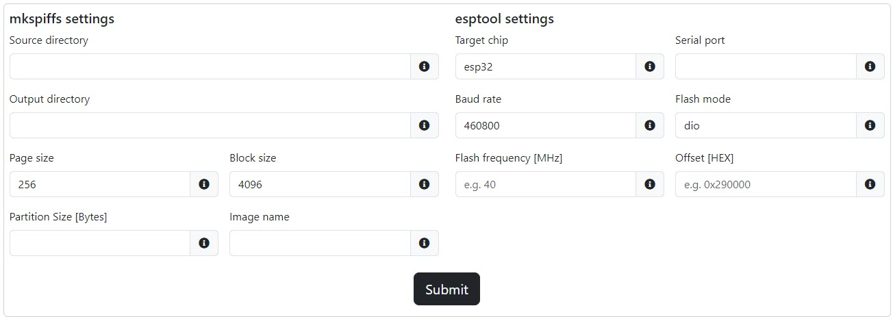

# ESP32 SPIFFS Burner

With this tool, you can effortlessly generate an image of your locally stored files and seamlessly transfer them to the SPIFFS (SPI Flash File System) on the ESP32 microcontroller.

## Requirements

Before using this tool, make sure you have the following:

### **Command Line Tools:**

- [mkspiffs](https://github.com/igrr/mkspiffs/releases): Needed for creating SPIFFS images.
- [esptool](https://docs.espressif.com/projects/esp-idf/en/latest/esp32/get-started/index.html#get-started-step-by-step): Required for flashing firmware to the ESP32.
- [esp32-burner](https://github.com/v8tix/ESP32-SPIFFS-burner/releases/): Utility that streamlines the image flashing process. K

**NOTE:** Ensure that they are included in your system's PATH.

### **Hardware:**

- *ESP32 with SPIFFS Partition*: The ESP32 microcontroller must have an SPIFFS partition set up. You can create the SPIFFS partition using one of the following options:
    - **Option 1:** Create the SPIFFS partition using a blank sketch in the Arduino 2.x IDE. Follow these steps:
        1. Open Arduino IDE.
        2. Go to **Tools -> Partition Scheme** and choose the appropriate scheme for your ESP32.
        3. Flash the blank sketch to your ESP32.
        4. Your ESP32 now has an SPIFFS partition.
    - **Option 2:** Follow the [ESP32 Partition Tables documentation](https://docs.espressif.com/projects/esp-idf/en/latest/esp32/api-guides/partition-tables.html) for detailed guidance. For additional examples and reference, explore the [partition table examples](https://github.com/espressif/arduino-esp32/tree/master/tools/partitions) in the official [arduino-esp32 GitHub repository](https://github.com/espressif/arduino-esp32).
### **Sketches:**

- **ESP32FlashPartitionsExplorer:** To gather detailed information about the partition table, you can run the [ESP32FlashPartitionsExplorer](https://github.com/v8tix/ESP32FlashPartitionsExplorer) tool directly on your ESP32 microcontroller.  
- **HelloSPIFFS:** To quickly test the SPI Flash File System (SPIFFS) on your ESP32, you can use the following Arduino sketch:
    ```
    #include <SPIFFS.h>

    void setup() {
      Serial.begin(115200);

      if (!SPIFFS.begin()) {
          Serial.println("Failed to mount SPIFFS");
          return;
      }

      File file = SPIFFS.open("/your_file_name.txt", "r");
      if (!file) {
          Serial.println("Failed to open file for reading");
          return;
      }

      Serial.println("File Content:");

      while (file.available()) {
          Serial.write(file.read());
      }

      file.close();
   }

  void loop() {
      // Do nothing in the loop
  }
  ```
## Usage

Follow the instructions below to use the utility:

- Display the help message:
    ```
    ./esp32-burner -help
    ```
- Run the program with the default settings (Note: Port 8080 must be utilized):
    ```
    ./esp32-burner
    ```
- Specify a custom port:
    ```
    ./esp32-burner -port=8081
    ```
**NOTE:** For Windows, remember to include the .exe extension when executing the tool.

Now, navigate to the following address in your file browser: http://localhost:8080 (default port) or http://localhost:[custom-port] (if you specified a custom port).

## Form Fields



### mkspiffs settings

#### Source Directory
- Specifies the source directory containing the files to be included in the SPIFFS image.
- Possible Values: `Path to a directory`

#### Output Directory
- Specifies the output directory for the generated SPIFFS image.
- Possible Values: `Path to a directory`

#### Page Size
- This value represents the minimum unit of data that can be written to or read from the SPIFFS.
- Possible Values: `256`

#### Block Size
- This value represents the minimum unit of data that can be erased in the SPIFFS.
- Possible Values: `4096`

#### Partition Size
- Specifies the size of the SPIFFS partition in bytes (can be obtained from a partition table).
- To obtain this value, please visit the [ESP32FlashPartitionsExplorer](https://github.com/v8tix/ESP32FlashPartitionsExplorer) on GitHub

#### Image Name
- Specifies the output file name for the generated SPIFFS image.
- Example: `image.bin`

## esptool settings

#### Target Chip
- Specifies the target chip, which is the ESP32 in this case.
- Possible Values: `esp32`

#### Serial Port
- Specifies the communication port to which the ESP32 is connected.
- Possible Values: `e.g., COM1 on Windows or /dev/ttyUSB0 on Linux`

#### Baud Rate
- Sets the baud rate for communication between the computer and the ESP32.
- Possible Values: `460800`.

#### Flash Mode
- Specifies the mode in which data is transferred between the ESP32 and the flash memory.
- Possible Values: `dio`.

#### Flash Frequency
- Specifies the speed at which data is transferred between the ESP32 and the flash memory.
- Possible Values in MHz: `40`.

#### Offset
- Specifies the starting address of the SPIFFS partition (can be obtained from a partition table).
- To obtain this value, please visit the [ESP32FlashPartitionsExplorer](https://github.com/v8tix/ESP32FlashPartitionsExplorer) on GitHub

## Contributors

- [Marco Almeida](mailto:marco.almeida@v8tix.com)

## License

This project is licensed under the [MIT License](LICENSE).

